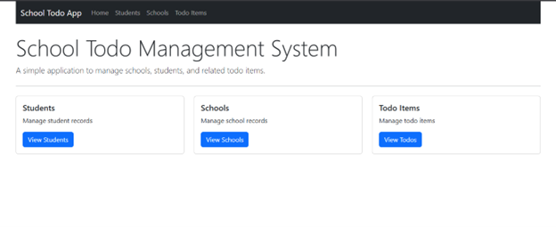
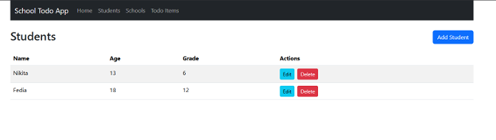
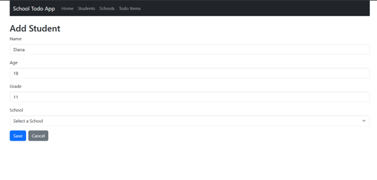
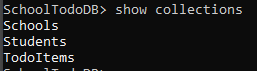
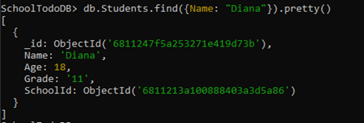

# School Todo Management System 🚀

Welcome to the **School Todo Management System**, a simple full-stack app to manage students, schools and todo items. 🎓🏫📝

---

## 🌟 Features

- **CRUD** operations for **Students**, **Schools** and **Todo Items**  
- **Interactive API docs** with **Swagger** 🧭  
- **Dependency Injection** for clean, testable code 🔧  
- **Responsive** React frontend with **React Router** & **Bootstrap** 📱💻  
- **MongoDB** for fast, scalable data storage 🍃  

---

## 🔧 Tech Stack

- **Backend:** ASP.NET Core Web API (.NET 6/7/8)  
- **Database:** MongoDB  
- **Frontend:** React + Axios + React Router + Bootstrap  
- **Docs:** Swagger / OpenAPI  

---

## 🚀 Getting Started

### 1. Clone this repo
```bash
git clone https://github.com/YourUser/YourRepo.git
cd YourRepo
```

### 2. Run the Backend
```bash
cd SchoolTodoApi
dotnet restore
dotnet run
```
- API will start on `https://localhost:5001`  
- Swagger UI at `https://localhost:5001/swagger`

### 3. Run the Frontend
```bash
cd school-todo-client
npm install
npm start
```
- React app runs on `http://localhost:3000` by default

---

## 📸 Screenshots

1. **Home Dashboard**  
   

2. **Student List**  
   

3. **Add Student Form**  
   

4. **MongoDB Collections**  
   

5. **Sample Document in MongoDB**  
   

*(Place your own screenshots in `./screenshots/` folder)*
